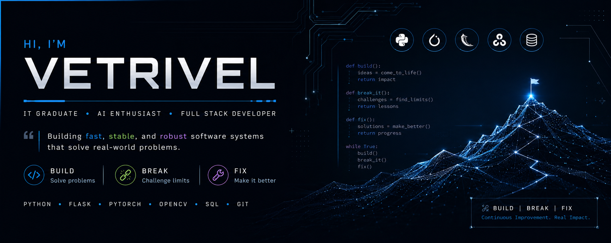

---
IT Graduate focused on building fast ⚡, stable 🛡, and robust 🚀 software systems. I enjoy solving complex problems and creating applications that prioritize performance, reliability, and real-world usability.

---
## 📌 Featured Projects

### 🔐 Secure Notes App
Encrypted note-taking application with master password authentication and backup restoration.

### 🌙 Low-Light Image Enhancement
DeepLabV3+ + HDRNet + Noise2Void pipeline for intelligent image enhancement.

### 📋 Flask Task Manager
Task management system supporting nested tasks and user authentication.

---
## 🎉Interested in:
- 🖼️ Computer Vision
- 🤖 Artificial Intelligence
- 📚 Full Stack Development
---
## 🔥 Currently Working On
- Secure Notes App
- React Task-manager
---

## 🛠️ Tech Stack

### Languages:

### Frameworks:

### Tools:

### OS

---

## ✨ Connect With Me

---
<h3 align="center"> Build | Break | Fix </h3>
